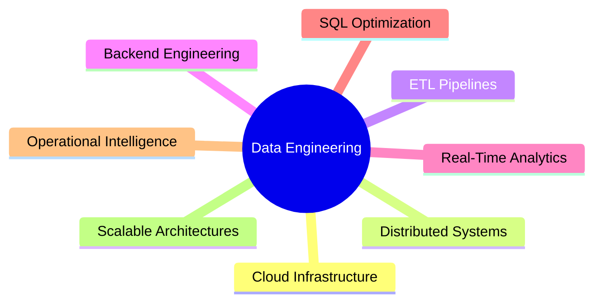

<div align="center">


<br>


<br><br>

<p align="center">


</p>

<br>


<br>


</div>

---

# 🧠 ENGINEERING PROFILE

<div align="center">

| Domain | Expertise |
|---|---|
| ⚡ Data Engineering | ETL Pipelines • Batch Processing • Data Warehousing |
| ☁️ Cloud Engineering | AWS EC2 • AWS S3 • Distributed Infrastructure |
| 🚀 Backend Engineering | REST APIs • Scalable Architectures • Concurrent Processing |
| 📊 Analytics Systems | Operational Intelligence • Reporting Automation |
| 🔄 Distributed Systems | Fault Tolerance • Synchronization • Replication |

</div>

---

# 🚀 ABOUT ME

I am a Computer Information Science graduate student at **Rivier University** with strong expertise in architecting scalable data engineering ecosystems, distributed backend systems, cloud-native analytics platforms, and high-throughput ETL infrastructures.

My engineering interests primarily focus on:

```yaml
Specializations:
  - Real-Time Data Engineering
  - Cloud Native ETL Architectures
  - Distributed Backend Systems
  - Scalable Data Processing
  - Analytics Infrastructure
  - Operational Intelligence Platforms
  - Backend Reliability Engineering
  - High Performance SQL Optimization
````

I enjoy building production-grade systems capable of processing millions of operational and analytical records efficiently while maintaining scalability, observability, reliability, and performance optimization.

---

# ⚙️ TECHNOLOGY STACK

<div align="center">

# 💻 LANGUAGES


<br><br>

# ☁️ CLOUD • DEVOPS • INFRASTRUCTURE


<br><br>

# 🗄️ DATABASES • STORAGE


<br><br>

# ⚡ DATA ENGINEERING


</div>

---

# 🏢 PROFESSIONAL EXPERIENCE

---

## 📊 DATA ENGINEER — EVRY INDIA PVT LIMITED

📍 Bangalore, India
📅 Aug 2022 — Jul 2024

### 🔥 ENGINEERING HIGHLIGHTS

```diff
+ Processed 1.6+ Million Enterprise Records
+ Built High Throughput ETL Pipelines
+ Optimized SQL Workloads & Reporting Systems
+ Automated Validation & Reconciliation Engines
```

* Architected scalable ETL workflows processing enterprise-scale transactional and operational datasets across reporting ecosystems.

* Optimized SQL aggregation and transformation workloads reducing reporting latency from **21 minutes → under 7 minutes**.

* Built automated reconciliation frameworks detecting:

  * duplicate records
  * ingestion anomalies
  * schema inconsistencies
  * validation failures

* Integrated AWS S3 archival and ingestion strategies supporting scalable centralized dataset management.

* Improved operational efficiency by automating recurring reporting workflows reducing manual effort significantly.

* Collaborated across analytics, backend, and operations teams to stabilize production data pipelines and backend workflows.

---

## 💻 SOFTWARE ENGINEER INTERN — INAUTIX TECHNOLOGIES INDIA PVT LTD

📍 Chennai, India
📅 Aug 2021 — Jul 2022

### 🔥 ENGINEERING HIGHLIGHTS

```diff
+ Backend Processing Utilities
+ REST API Synchronization
+ SQL Performance Optimization
+ Production Workflow Support
```

* Built backend data preprocessing and transformation utilities using Python and SQL.

* Developed automated cleansing pipelines improving reporting consistency and operational reliability.

* Assisted in REST API synchronization and backend integration workflows across enterprise internal platforms.

* Optimized indexing and reporting query execution strategies improving operational analytics performance.

---

# 🚀 FLAGSHIP ENGINEERING PROJECTS

---

# 🚚 REAL-TIME SHIPMENT TRACKING ANALYTICS PLATFORM

### ⚙️ Python • AWS EC2 • SQL • Docker • REST APIs

<div align="center">

| Scale        | Architecture | Processing |
| ------------ | ------------ | ---------- |
| 2.8M+ Events | Distributed  | Real-Time  |

</div>

### 🔥 PROJECT HIGHLIGHTS

* Built asynchronous ingestion pipelines for logistics events, routing scans, delivery tracking, and warehouse operations.

* Developed multithreaded backend workers supporting concurrent distributed event processing.

* Reduced analytics dashboard latency from **18 minutes → under 5 minutes** through indexed reporting optimization.

* Implemented retry handling, duplicate validation, ingestion monitoring, and recovery workflows improving system reliability.

---

# ☁️ CLOUD INFRASTRUCTURE LOG INTELLIGENCE SYSTEM

### ⚙️ Python • MySQL • Docker • AWS • Linux

<div align="center">

| Daily Volume | Monitoring | Intelligence |
| ------------ | ---------- | ------------ |
| 1M+ Logs     | Automated  | Operational  |

</div>

### 🔥 PROJECT HIGHLIGHTS

* Designed centralized infrastructure analytics platform processing millions of server and application logs daily.

* Built parsing and transformation engines for:

  * timeout analysis
  * authentication anomalies
  * failed request detection
  * operational monitoring

* Implemented indexed analytics structures improving monitoring query performance significantly.

* Integrated automated alerting and recovery mechanisms improving operational visibility.

---

# 📈 LARGE-SCALE CUSTOMER RETENTION ANALYTICS PIPELINE

### ⚙️ Python • Pandas • SQL • AWS S3 • NumPy

<div align="center">

| Dataset Size  | Processing  | Optimization     |
| ------------- | ----------- | ---------------- |
| 2.3M+ Records | Distributed | Memory Efficient |

</div>

### 🔥 PROJECT HIGHLIGHTS

* Developed large-scale analytics workflows supporting churn analysis and customer segmentation.

* Engineered preprocessing pipelines for:

  * normalization
  * transformation batching
  * incomplete transaction handling
  * analytical enrichment

* Reduced preprocessing runtime from **110 minutes → under 47 minutes** using optimized transformation strategies.

---

# 🔄 DISTRIBUTED FINANCIAL TRANSACTION SYNCHRONIZATION ENGINE

### ⚙️ Java • MySQL • Docker • AWS EC2

<div align="center">

| Architecture | Synchronization | Reliability    |
| ------------ | --------------- | -------------- |
| Distributed  | Concurrent      | Fault-Tolerant |

</div>

### 🔥 PROJECT HIGHLIGHTS

* Built distributed synchronization engine supporting concurrent transactional replication across backend environments.

* Implemented thread-safe recovery and retry workflows improving consistency during parallel execution.

* Optimized indexing and transactional handling increasing synchronization throughput significantly.

---

# 📊 GITHUB ANALYTICS

<div align="center">


<br><br>


<br><br>


</div>

---

# 🌍 ENGINEERING DOMAINS

<div align="center">



</div>

---

# 📫 CONNECT WITH ME

<div align="center">

<a href="https://www.linkedin.com/in/gopi-krishna-inturi-6921aa2a6/">

</a>

<a href="https://github.com/GopiKrishnaInturi">

</a>

<a href="mailto:gopikrishnainturi9@gmail.com">

</a>

</div>

---

<div align="center">


### Engineering Scalable Data Platforms • Cloud Native Analytics • Distributed Intelligence Systems

</div>
```
